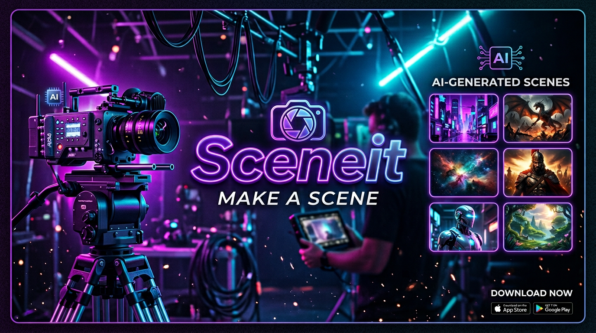

# SceneIt — AI Image Generation

> **Make a Scene.** Create cinematic visuals, real-life photos, animations, and cover art with AI.



SceneIt is a mobile-first AI image generation app built with TanStack Start, React 19, Tailwind v4, and Framer Motion. It ships with a guided prompt builder, scene templates, presets, reference image uploads, and a built-in gallery.

---

## ✨ Features

- **4 creation modes** — Cinematic, Camera (real photo), Animation, Cover Art
- **Prompt builder** — Subject / Outfit / Location / Mood chips with smart prompt assembly
- **Scene templates** — Curated + user-saved templates
- **Quick presets** — One-tap looks (Hood Vlog, Luxury Boss, Anime Protagonist, etc.)
- **Reference images** — Upload style/subject references
- **Advanced controls** — Creativity, style strength, HD toggle, lighting
- **Gallery** — View, save, copy prompt, generate similar
- **Mobile-first** — Bottom nav, neon-on-dark theme, 60fps animations

---

## 🧱 Tech Stack

| Layer | Tech |
|---|---|
| Framework | TanStack Start v1 (React 19, SSR) |
| Routing | TanStack Router (file-based) |
| Styling | Tailwind CSS v4 (CSS-first config) |
| State | Zustand |
| Animation | Framer Motion |
| UI primitives | shadcn/ui + Radix |
| Build | Vite 7 |
| Hosting | Cloudflare Workers (via @cloudflare/vite-plugin) |

---

## 🚀 Local Development

Requires **Bun** (or npm/pnpm).

```bash
bun install
bun run dev
```

Open http://localhost:5173.

### Build & preview

```bash
bun run build      # production build
bun run preview    # preview the production build locally
```

---

## 🐙 Pushing to GitHub

This project syncs **bidirectionally** with GitHub through Lovable.

1. In the Lovable editor, open **Connectors → GitHub → Connect project**.
2. Authorize the Lovable GitHub App.
3. Pick the GitHub account/org → **Create Repository**.

After that:
- Changes you make in Lovable auto-push to GitHub.
- Pushes to GitHub auto-sync back to Lovable.
- Clone the repo locally to develop with your own IDE.

```bash
git clone https://github.com/<your-org>/<your-repo>.git
cd <your-repo>
bun install
```

---

## ☁️ Deploying to Cloudflare Workers

The project is pre-configured for Cloudflare Workers via `wrangler.jsonc`:

```jsonc
{
  "name": "tanstack-start-app",
  "compatibility_date": "2025-09-24",
  "compatibility_flags": ["nodejs_compat"],
  "main": "@tanstack/react-start/server-entry"
}
```

### Option 1 — Deploy via Wrangler CLI

```bash
# 1. Install Wrangler globally (or use npx)
bun add -g wrangler

# 2. Login to Cloudflare
wrangler login

# 3. Build the production bundle
bun run build

# 4. Deploy
wrangler deploy
```

Your app will be live at `https://tanstack-start-app.<your-subdomain>.workers.dev`.

### Option 2 — Connect GitHub to Cloudflare (CI/CD)

1. Cloudflare Dashboard → **Workers & Pages → Create → Connect to Git**
2. Select your GitHub repo
3. Build settings:
   - **Build command:** `bun run build`
   - **Deploy command:** `npx wrangler deploy`
   - **Root directory:** `/`
4. Add any environment variables (see below)
5. Save → every push to `main` deploys automatically

### Custom domain

Cloudflare dashboard → your Worker → **Settings → Triggers → Custom Domains → Add Custom Domain**.

---

## 🔐 Environment Variables & Secrets

Currently the app runs **fully client-side** with mock generation (using `picsum.photos`). No env vars are required for basic deployment.

If/when you wire up real AI generation or persistence, add these:

| Variable | Where | Purpose |
|---|---|---|
| `VITE_SUPABASE_URL` | Build-time (public) | Lovable Cloud project URL |
| `VITE_SUPABASE_PUBLISHABLE_KEY` | Build-time (public) | Public anon key |
| `SUPABASE_SERVICE_ROLE_KEY` | Worker secret | Admin operations (server only) |
| `LOVABLE_API_KEY` | Worker secret | Lovable AI Gateway (auto-set by Lovable Cloud) |

### Adding secrets in Cloudflare

```bash
wrangler secret put SUPABASE_SERVICE_ROLE_KEY
wrangler secret put LOVABLE_API_KEY
```

Or via dashboard: **Worker → Settings → Variables & Secrets → Add**.

> ⚠️ Never commit secrets. Only `VITE_*` prefixed vars are safe in the client bundle.

---

## 📁 Project Structure

```
src/
├── routes/              # File-based routes (TanStack Router)
│   ├── __root.tsx       # Root layout, meta tags, favicon
│   ├── index.tsx        # Landing page
│   ├── create.tsx       # Scene builder
│   └── gallery.tsx      # Generated images gallery
├── components/          # App + shadcn UI components
├── lib/store.ts         # Zustand state + prompt builder
├── styles.css           # Tailwind v4 + design tokens
└── assets/              # Brand images

public/
├── favicon.png
└── og-image.jpg
```

---

## 🎨 Brand Assets

- **Logo:** `src/assets/sceneit-logo.png`
- **Favicon:** `public/favicon.png`
- **Social/OG image:** `public/og-image.jpg` (1200×630)

Brand palette (defined in `src/styles.css`): Neon Purple, Neon Blue, Neon Pink on dark surfaces.

---

## 📜 License

MIT.

Built with ❤️ on [Lovable](https://lovable.dev).
